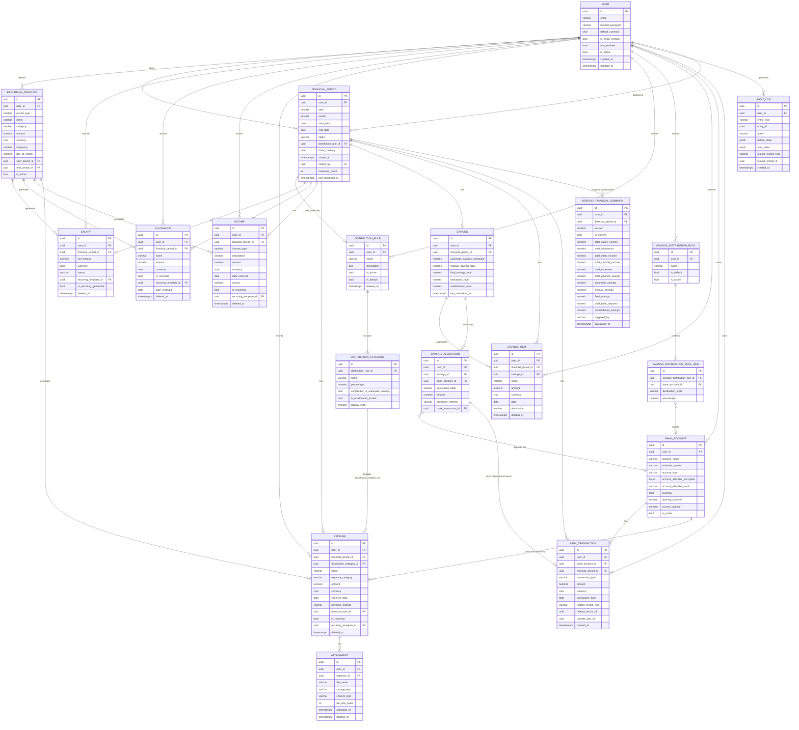

# Sutura — Database ERD (Phase 1 Discovery)

Covers every entity from spec §28 plus the entities added during discovery (`RecurringTemplate`,
`SavingsDistributionRule`, `SavingsDistributionRuleItem`) and the deliberate omission of a separate
`DistributionItem` table (see `decisions.md` D-006). All monetary columns are `NUMERIC`, never
`FLOAT`/`DOUBLE`. All primary keys are `UUID` (D-015). All tables that hold user data carry
`user_id` (D-020, §34).

## 1. Mermaid ERD

## 2. Written entity reference

Every table implicitly has `created_at TIMESTAMPTZ NOT NULL DEFAULT now()` and
`updated_at TIMESTAMPTZ NOT NULL DEFAULT now()` (auto-updated by an ORM `onupdate`/DB trigger) unless
noted otherwise (append-only tables like `BankTransaction`, `AuditLog`, `MonthlyFinancialSummary`
versions omit `updated_at` — they are never updated in place).

### User
| Field | Type | Notes |
|---|---|---|
| id | UUID PK | |
| email | VARCHAR(255) | `UNIQUE NOT NULL` |
| hashed_password | VARCHAR(255) | nullable if OAuth-only account |
| full_name | VARCHAR(150) | |
| default_currency | CHAR(3) | `NOT NULL DEFAULT 'GMD'` |
| is_email_verified | BOOLEAN | `NOT NULL DEFAULT false` |
| mfa_enabled | BOOLEAN | `NOT NULL DEFAULT false` |
| is_active | BOOLEAN | `NOT NULL DEFAULT true` |

Indexes: `UNIQUE(email)`.

### FinancialPeriod (spec §5)
| Field | Type | Notes |
|---|---|---|
| id | UUID PK | |
| user_id | UUID FK → User | `NOT NULL` |
| year | SMALLINT | `NOT NULL` |
| month | SMALLINT | `NOT NULL CHECK (month BETWEEN 1 AND 12)` |
| start_date / end_date | DATE | derived from year/month, stored for query convenience |
| status | VARCHAR(10) | `NOT NULL DEFAULT 'OPEN' CHECK (status IN ('OPEN','CLOSED'))` |
| distribution_rule_id | UUID FK → DistributionRule | nullable until user selects a rule (§10) |
| base_currency | CHAR(3) | `NOT NULL DEFAULT 'GMD'` (D-002) |
| closed_at | TIMESTAMPTZ | nullable |
| closed_by | UUID FK → User | nullable |
| reopened_count | INT | `NOT NULL DEFAULT 0` |
| last_reopened_at | TIMESTAMPTZ | nullable |

Constraints/indexes: `UNIQUE(user_id, year, month)` (D-017); `INDEX(user_id, status)` for dashboard
"current open period" lookups.

### RecurringTemplate (added, D-003 — not in §28's list)
| Field | Type | Notes |
|---|---|---|
| id | UUID PK | |
| user_id | UUID FK → User | `NOT NULL` |
| record_type | VARCHAR(20) | `CHECK IN ('SALARY','ALLOWANCE','INCOME','EXPENSE')` |
| name | VARCHAR(150) | label shown to the user, e.g. "Monthly Rent" |
| category | VARCHAR(30) | nullable; used when record_type is ALLOWANCE/INCOME/EXPENSE |
| amount | NUMERIC(14,4) | `NOT NULL CHECK (amount >= 0)` |
| currency | CHAR(3) | `NOT NULL` |
| frequency | VARCHAR(10) | `NOT NULL CHECK (frequency = 'MONTHLY')` — v1 only (documented, D-003) |
| day_of_month | SMALLINT | nullable, informational for the generation job |
| start_period_id | UUID FK → FinancialPeriod | first period this template applies to |
| end_period_id | UUID FK → FinancialPeriod | nullable, last period (inclusive) it applies to |
| is_active | BOOLEAN | `NOT NULL DEFAULT true` |
| notes | TEXT | |

Indexes: `INDEX(user_id, is_active)`.

### Salary (spec §6)
| Field | Type | Notes |
|---|---|---|
| id | UUID PK | |
| user_id | UUID FK → User | `NOT NULL` |
| financial_period_id | UUID FK → FinancialPeriod | `NOT NULL` |
| net_amount | NUMERIC(14,4) | `NOT NULL CHECK (net_amount >= 0)` |
| currency | CHAR(3) | `NOT NULL` |
| status | VARCHAR(10) | `CHECK IN ('EXPECTED','RECEIVED')`, default `'RECEIVED'` |
| notes | TEXT | |
| recurring_template_id | UUID FK → RecurringTemplate | nullable |
| is_recurring_generated | BOOLEAN | `NOT NULL DEFAULT false` |
| deleted_at | TIMESTAMPTZ | nullable (soft delete, D-016) |

Constraints: `UNIQUE(user_id, financial_period_id)` — one salary per period (D-008).

### Allowance (spec §7)
| Field | Type | Notes |
|---|---|---|
| id | UUID PK | |
| user_id | UUID FK → User | `NOT NULL` |
| financial_period_id | UUID FK → FinancialPeriod | `NOT NULL` |
| name | VARCHAR(100) | `NOT NULL` (Housing, Transport, Communication, Medical, Responsibility, Overtime, Meal, Other — validated at API layer, not a DB enum) |
| amount | NUMERIC(14,4) | `NOT NULL CHECK (amount >= 0)` |
| currency | CHAR(3) | `NOT NULL` |
| is_recurring | BOOLEAN | `NOT NULL DEFAULT false` |
| recurring_template_id | UUID FK → RecurringTemplate | nullable |
| date_received | DATE | `NOT NULL` |
| notes | TEXT | |
| deleted_at | TIMESTAMPTZ | nullable |

Indexes: `INDEX(user_id, financial_period_id)`.

### Income (spec §8; excludes salary/allowance — D-007)
| Field | Type | Notes |
|---|---|---|
| id | UUID PK | |
| user_id | UUID FK → User | `NOT NULL` |
| financial_period_id | UUID FK → FinancialPeriod | `NOT NULL` |
| income_type | VARCHAR(30) | `NOT NULL CHECK IN ('IN_COUNTRY_PAYMENT','PER_DIEM','FREELANCE','BUSINESS','INVESTMENT','OTHER')` |
| description | VARCHAR(255) | `NOT NULL` |
| amount | NUMERIC(14,4) | `NOT NULL CHECK (amount >= 0)` |
| currency | CHAR(3) | `NOT NULL` |
| date_received | DATE | `NOT NULL` |
| source | VARCHAR(150) | |
| is_recurring | BOOLEAN | `NOT NULL DEFAULT false` |
| recurring_template_id | UUID FK → RecurringTemplate | nullable |
| notes | TEXT | |
| deleted_at | TIMESTAMPTZ | nullable |

Indexes: `INDEX(user_id, financial_period_id)`, `INDEX(income_type)`.

### Expense (spec §9; also serves §12's "distribution category items" — D-006)
| Field | Type | Notes |
|---|---|---|
| id | UUID PK | |
| user_id | UUID FK → User | `NOT NULL` |
| financial_period_id | UUID FK → FinancialPeriod | `NOT NULL` |
| distribution_category_id | UUID FK → DistributionCategory | nullable only before a rule is selected for the period; required by service-layer validation once one exists |
| name | VARCHAR(150) | `NOT NULL` |
| expense_category | VARCHAR(30) | `NOT NULL CHECK IN ('RENT','FOOD','TRANSPORTATION','ELECTRICITY','WATER','INTERNET','PHONE','EDUCATION','HEALTHCARE','FAMILY_SUPPORT','ENTERTAINMENT','SHOPPING','DEBT_REPAYMENT','OTHER')` — independent of distribution_category_id, see D-006 |
| amount | NUMERIC(14,4) | `NOT NULL CHECK (amount > 0)` |
| currency | CHAR(3) | `NOT NULL` |
| expense_date | DATE | `NOT NULL` |
| payment_method | VARCHAR(20) | `CHECK IN ('CASH','BANK_TRANSFER','CARD','MOBILE_MONEY','OTHER')` |
| bank_account_id | UUID FK → BankAccount | nullable, "account used" |
| notes | TEXT | |
| is_recurring | BOOLEAN | `NOT NULL DEFAULT false` |
| recurring_template_id | UUID FK → RecurringTemplate | nullable |
| deleted_at | TIMESTAMPTZ | nullable |

Indexes: `INDEX(user_id, financial_period_id)`, `INDEX(distribution_category_id)`,
`INDEX(user_id, expense_category)` for §24 spending-by-category analytics.

### DistributionRule (spec §10)
| Field | Type | Notes |
|---|---|---|
| id | UUID PK | |
| user_id | UUID FK → User | `NOT NULL` |
| name | VARCHAR(100) | `NOT NULL` |
| description | TEXT | |
| is_active | BOOLEAN | `NOT NULL DEFAULT true` |
| is_default | BOOLEAN | `NOT NULL DEFAULT false` |
| deleted_at | TIMESTAMPTZ | nullable — retired rules are never hard-deleted while any period references them |

Constraints: partial unique index `UNIQUE(user_id) WHERE is_default = true`.

### DistributionCategory (spec §10/§12)
| Field | Type | Notes |
|---|---|---|
| id | UUID PK | |
| distribution_rule_id | UUID FK → DistributionRule | `NOT NULL` |
| name | VARCHAR(100) | `NOT NULL` |
| percentage | NUMERIC(5,2) | `NOT NULL CHECK (percentage >= 0 AND percentage <= 100)` |
| contributes_to_automatic_savings | BOOLEAN | `NOT NULL DEFAULT true` (D-001) |
| is_unallocated_bucket | BOOLEAN | `NOT NULL DEFAULT false` (D-010) |
| display_order | SMALLINT | `NOT NULL DEFAULT 0` |

Constraints: `UNIQUE(distribution_rule_id, name)`; partial unique index
`UNIQUE(distribution_rule_id) WHERE is_unallocated_bucket`; **invariant enforced in service layer**
(not a DB constraint, D-009): `SUM(percentage) FOR distribution_rule_id = 100.00` at all times.

### Savings (spec §15/§28 — per-period cached rollup, D-012)
| Field | Type | Notes |
|---|---|---|
| id | UUID PK | |
| user_id | UUID FK → User | `NOT NULL` |
| financial_period_id | UUID FK → FinancialPeriod | `NOT NULL`, `UNIQUE` (1:1) |
| automatic_savings_computed | NUMERIC(14,4) | `NOT NULL DEFAULT 0` |
| manual_savings_total | NUMERIC(14,4) | `NOT NULL DEFAULT 0` |
| final_savings_total | NUMERIC(14,4) | `NOT NULL DEFAULT 0` (= automatic + manual) |
| distributed_total | NUMERIC(14,4) | `NOT NULL DEFAULT 0` |
| undistributed_total | NUMERIC(14,4) | `NOT NULL DEFAULT 0 CHECK (undistributed_total >= 0)` |
| last_calculated_at | TIMESTAMPTZ | `NOT NULL` |

### SavingsItem (spec §16 — manual savings entries)
| Field | Type | Notes |
|---|---|---|
| id | UUID PK | |
| user_id | UUID FK → User | `NOT NULL` |
| financial_period_id | UUID FK → FinancialPeriod | `NOT NULL` |
| savings_id | UUID FK → Savings | `NOT NULL` |
| name | VARCHAR(150) | `NOT NULL` |
| amount | NUMERIC(14,4) | `NOT NULL CHECK (amount > 0)` |
| currency | CHAR(3) | `NOT NULL` |
| date | DATE | `NOT NULL` |
| destination | VARCHAR(150) | free text, e.g. "Emergency fund" |
| notes | TEXT | |
| deleted_at | TIMESTAMPTZ | nullable |

### SavingsDistributionRule (added, D-013 — parallel to DistributionRule for savings destinations)
| Field | Type | Notes |
|---|---|---|
| id | UUID PK | |
| user_id | UUID FK → User | `NOT NULL` |
| name | VARCHAR(100) | `NOT NULL` |
| is_default | BOOLEAN | `NOT NULL DEFAULT false` |
| is_active | BOOLEAN | `NOT NULL DEFAULT true` |

Constraints: partial unique index `UNIQUE(user_id) WHERE is_default = true`.

### SavingsDistributionRuleItem (added, D-013)
| Field | Type | Notes |
|---|---|---|
| id | UUID PK | |
| savings_distribution_rule_id | UUID FK → SavingsDistributionRule | `NOT NULL` |
| bank_account_id | UUID FK → BankAccount | nullable |
| destination_label | VARCHAR(150) | nullable |
| percentage | NUMERIC(5,2) | `NOT NULL CHECK (percentage >= 0 AND percentage <= 100)` |

Constraints: `CHECK (bank_account_id IS NOT NULL OR destination_label IS NOT NULL)`;
**invariant enforced in service layer**: `SUM(percentage) FOR rule = 100.00`.

### SavingsAllocation (spec §19/§20/§28)
| Field | Type | Notes |
|---|---|---|
| id | UUID PK | |
| user_id | UUID FK → User | `NOT NULL` |
| savings_id | UUID FK → Savings | `NOT NULL` |
| bank_account_id | UUID FK → BankAccount | nullable (D-014) |
| destination_label | VARCHAR(150) | nullable, used when bank_account_id is null |
| amount | NUMERIC(14,4) | `NOT NULL CHECK (amount > 0)` |
| allocation_method | VARCHAR(10) | `NOT NULL CHECK IN ('AUTO','MANUAL')` |
| bank_transaction_id | UUID FK → BankTransaction | nullable, set once posted to the ledger |

Constraints: `CHECK (bank_account_id IS NOT NULL OR destination_label IS NOT NULL)`;
**invariant enforced in service layer**: `SUM(amount) FOR savings_id <= Savings.final_savings_total`
(never silently over-allocate, §19).

### BankAccount (spec §17)
| Field | Type | Notes |
|---|---|---|
| id | UUID PK | |
| user_id | UUID FK → User | `NOT NULL` |
| account_name | VARCHAR(100) | `NOT NULL` |
| institution_name | VARCHAR(100) | |
| account_type | VARCHAR(20) | `CHECK IN ('BANK','MOBILE_MONEY','CASH','SAVINGS','INVESTMENT','OTHER')` |
| account_identifier_encrypted | BYTEA | nullable (encrypted at rest; no plaintext column) |
| account_identifier_last4 | VARCHAR(4) | for masked display, e.g. `**** 1234` |
| currency | CHAR(3) | `NOT NULL DEFAULT 'GMD'` |
| opening_balance | NUMERIC(14,4) | `NOT NULL DEFAULT 0` |
| current_balance | NUMERIC(14,4) | `NOT NULL DEFAULT 0`, denormalized (D-011) |
| is_active | BOOLEAN | `NOT NULL DEFAULT true` |
| notes | TEXT | |

Indexes: `INDEX(user_id, is_active)`.

### BankTransaction (spec §18 — append-only ledger, D-016)
| Field | Type | Notes |
|---|---|---|
| id | UUID PK | |
| user_id | UUID FK → User | `NOT NULL` |
| bank_account_id | UUID FK → BankAccount | `NOT NULL` |
| financial_period_id | UUID FK → FinancialPeriod | `NOT NULL` |
| transaction_type | VARCHAR(15) | `NOT NULL CHECK IN ('DEPOSIT','WITHDRAWAL','TRANSFER_IN','TRANSFER_OUT','ADJUSTMENT')` |
| amount | NUMERIC(14,4) | `NOT NULL CHECK (amount > 0)` — sign is implied by `transaction_type`, never a negative amount |
| currency | CHAR(3) | `NOT NULL` |
| transaction_date | DATE | `NOT NULL` |
| source_reference | VARCHAR(150) | |
| description | TEXT | |
| related_record_type | VARCHAR(30) | nullable, e.g. `'SAVINGS_ALLOCATION'`, `'EXPENSE'`, `'MANUAL'` |
| related_record_id | UUID | nullable |
| transfer_pair_id | UUID | nullable, links a `TRANSFER_OUT`/`TRANSFER_IN` pair |

No `updated_at`, no soft delete — corrections are new `ADJUSTMENT` rows referencing the original via
`related_record_id`. Indexes: `INDEX(bank_account_id, transaction_date)`,
`INDEX(financial_period_id)`.

### MonthlyFinancialSummary (spec §22/§23/§28 — versioned, append-only, D-004)
| Field | Type | Notes |
|---|---|---|
| id | UUID PK | |
| user_id | UUID FK → User | `NOT NULL` |
| financial_period_id | UUID FK → FinancialPeriod | `NOT NULL` |
| version | SMALLINT | `NOT NULL` |
| is_current | BOOLEAN | `NOT NULL DEFAULT true` |
| total_salary_income | NUMERIC(14,4) | `NOT NULL` |
| total_allowances | NUMERIC(14,4) | `NOT NULL` |
| total_other_income | NUMERIC(14,4) | `NOT NULL` |
| total_monthly_income | NUMERIC(14,4) | `NOT NULL` |
| total_expenses | NUMERIC(14,4) | `NOT NULL` |
| total_planned_savings | NUMERIC(14,4) | `NOT NULL` |
| automatic_savings | NUMERIC(14,4) | `NOT NULL` |
| manual_savings | NUMERIC(14,4) | `NOT NULL` |
| final_savings | NUMERIC(14,4) | `NOT NULL` |
| total_bank_deposits | NUMERIC(14,4) | `NOT NULL` |
| undistributed_savings | NUMERIC(14,4) | `NOT NULL` |
| triggered_by | VARCHAR(10) | `CHECK IN ('CLOSE','REOPEN_RECALC','MANUAL_REFRESH')` |
| calculated_at | TIMESTAMPTZ | `NOT NULL` |

Constraints: `UNIQUE(financial_period_id, version)`; partial unique index
`UNIQUE(financial_period_id) WHERE is_current` guarantees exactly one current summary per period.

### Attachment (spec §9/§28 — scoped to Expense, D-005)
| Field | Type | Notes |
|---|---|---|
| id | UUID PK | |
| user_id | UUID FK → User | `NOT NULL` |
| expense_id | UUID FK → Expense | `NOT NULL` |
| file_name | VARCHAR(255) | `NOT NULL` |
| storage_key | VARCHAR(500) | `NOT NULL` (S3 object key) |
| content_type | VARCHAR(100) | `NOT NULL`, validated against an allow-list server-side |
| file_size_bytes | INT | `NOT NULL CHECK (file_size_bytes > 0)`, max enforced at API layer |
| uploaded_at | TIMESTAMPTZ | `NOT NULL` |
| deleted_at | TIMESTAMPTZ | nullable |

### AuditLog (spec §36/§28)
| Field | Type | Notes |
|---|---|---|
| id | UUID PK | |
| user_id | UUID FK → User | `NOT NULL` (actor) |
| entity_type | VARCHAR(50) | `NOT NULL`, e.g. `'Expense'`, `'FinancialPeriod'` |
| entity_id | UUID | `NOT NULL` |
| action | VARCHAR(20) | `NOT NULL CHECK IN ('CREATE','UPDATE','DELETE','CLOSE','REOPEN','ALLOCATE')` |
| before_state | JSONB | nullable |
| after_state | JSONB | nullable |
| related_record_type | VARCHAR(50) | nullable |
| related_record_id | UUID | nullable |
| created_at | TIMESTAMPTZ | `NOT NULL DEFAULT now()`, append-only |

Indexes: `INDEX(user_id, entity_type, entity_id)`, `INDEX(created_at)`.

## 3. Cross-cutting invariants summary

| Invariant | Mechanism |
|---|---|
| Every financial table is user-scoped | `user_id NOT NULL` FK + repository queries always filter by it (D-020) |
| Distribution percentages total exactly 100% | Service-layer transactional validation (D-009) |
| Savings-distribution percentages total exactly 100% | Same mechanism (D-009/D-013) |
| One active distribution rule selection per period | `FinancialPeriod.distribution_rule_id` is a single FK, not a join table |
| One salary per period | `UNIQUE(user_id, financial_period_id)` on Salary (D-008) |
| One default DistributionRule / SavingsDistributionRule per user | Partial unique index `WHERE is_default` |
| One Unallocated category per rule | Partial unique index `WHERE is_unallocated_bucket` |
| One current summary version per period | Partial unique index `WHERE is_current` |
| Savings allocations never exceed final savings | Service-layer check against `Savings.final_savings_total` before insert (D-014) |
| Money never stored as float | `NUMERIC(14,4)` everywhere, `Decimal` in Python (D-019) |
| Closed periods immutable without explicit reopen | Service-layer status check + `AuditLog` on close/reopen (D-004) |
| No double counting across financial event / allocation / expense / transaction | Distinct tables linked by FK reference only, never re-derived by summing across layers (D-006, §27) |
